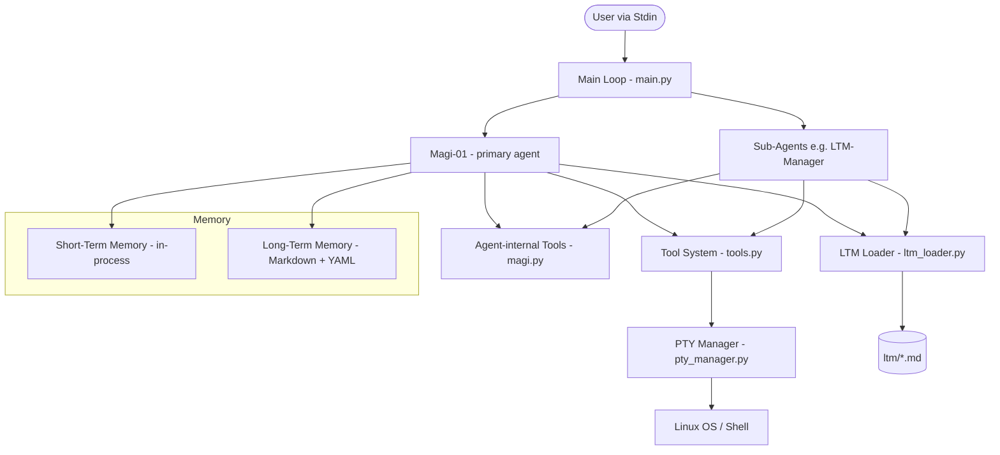
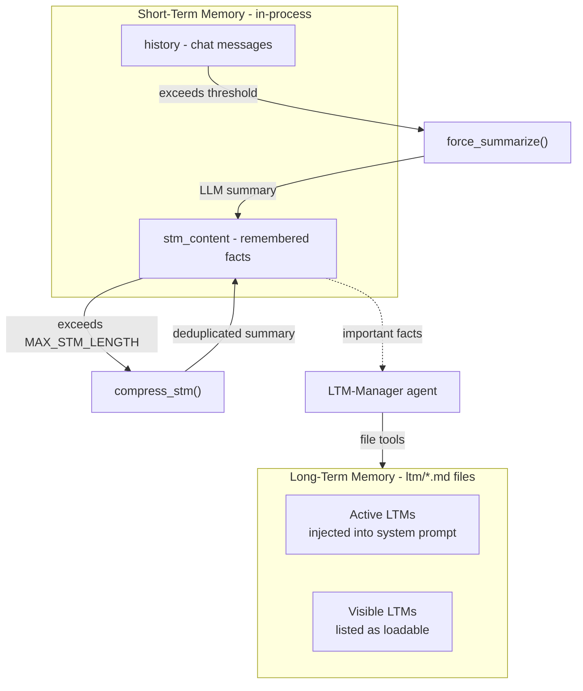
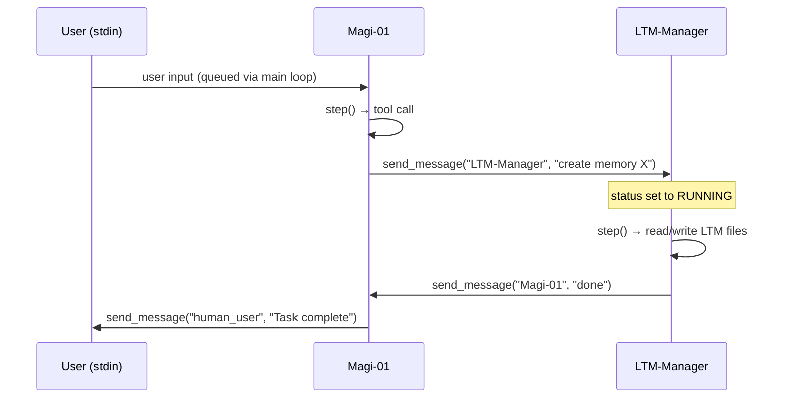

# Magi Agent Framework Architecture

## Overview

Magi is a multi-agent framework that lets LLM-powered agents collaborate to solve coding and terminal tasks. A primary coordinator ("Magi-01") orchestrates work and can spawn specialised sub-agents (e.g. "LTM-Manager") at runtime. Every agent shares the same tool surface and memory subsystems but operates with its own independent context window, short-term memory, and long-term memory visibility.

The framework is built in Python 3.12+, managed with `uv`, and calls Azure OpenAI (`o4-mini`) for all LLM inference.

---

## System Architecture



---

## Core Components

### 1. Entry Point &mdash; `main.py`

| Concern | Detail |
|---|---|
| **Input handling** | A daemon thread (`input_listener`) reads `stdin` line-by-line and pushes to a `queue.Queue`. |
| **Agent bootstrap** | Creates `Magi-01` (coordinator) and `LTM-Manager`, then enters the main loop. |
| **Main loop** | Drains the input queue into the coordinator's `history`, sets its status to `RUNNING`, then iterates over all registered agents calling `step()` on each that is `RUNNING`. Idles with a `0.5 s` sleep when nothing is active. |
| **Workspace** | Changes `cwd` into `agent_workspace/` so agent file operations are sandboxed by default. |

### 2. Agent Core &mdash; `magi.py`

The `agent` class encapsulates an autonomous LLM actor. Every instance self-registers in the global `agents` dict on construction.

#### Key attributes

| Attribute | Purpose |
|---|---|
| `name` / `description` | Identity and role description (injected into LLM context). |
| `status` | `RUNNING`, `STOPPED`, or `ERROR`. |
| `history` | List of chat messages (the live conversation context). |
| `stm_content` | Accumulated short-term memory string. |
| `ltm_content` | Pre-rendered long-term memory block loaded on init and on LTM changes. |
| `active_ltms` / `visible_ltms` | LTM objects partitioned by access level for this agent. |
| `agent_tools` | Dict of agent-bound methods exposed as callable tools. |

#### Agent-internal tools (bound methods)

| Tool | Description |
|---|---|
| `active_ltm(name)` | Activates an LTM by adding the agent to its `active_for` list, then reloads LTM. |
| `remember(text)` | Appends a note to `stm_content`. Auto-compresses if over `MAX_STM_LENGTH`. |
| `summarize_history()` | Downloads messages to JSON, summarises history via LLM, keeps last 8 messages. |
| `compress_stm()` | LLM-summarises `stm_content`, deduplicating against active LTM. |
| `wait()` | Sets status to `STOPPED`; auto-summarises if history exceeds threshold. |
| `send_message(recipient, message)` | Routes a message to `human_user` (stdout) or another agent's `history`. Wakes stopped agents. |
| `make_new_agent(name, description)` | Spawns a new `agent` instance at runtime. |
| `edit_stm(agent_name, new_content)` | Overwrites another agent's `stm_content`. |

#### `step()` — single execution cycle

1. Builds the prompt via `get_messages()` (system prompt = LTM + tool descriptions + STM + system data + history).
2. Calls `client.beta.chat.completions.parse()` with `AgentStep` as `response_format` (structured output).
3. If the response contains a `tool_name`, resolves it from agent-internal tools first, then from `available_tools`.
4. Executes the tool, appends the result as a `user` message, and returns `"RUNNING"`.
5. On error or the `wait` tool setting status to `STOPPED`, returns `"ERROR"` or `"STOPPED"`.

#### LLM integration

Two module-level helpers wrap Azure OpenAI calls:

| Function | API used | Purpose |
|---|---|---|
| `ai_request` | `client.responses.parse` | General text or structured (Pydantic) generation. Used for summarisation/compression. |
| `ai_tool_request` | `client.chat.completions.create` with `tools` | Native function-calling (currently unused in the main loop but available). |

### 3. Tool System &mdash; `tools.py`

External (stateless) tools available to every agent. All path arguments are resolved against `cwd` via `_resolve_path()`.

| Tool | Description |
|---|---|
| `run_command(command, cwd, timeout)` | Spawns a PTY command; waits up to `timeout` seconds, then backgrounds it. |
| `command_status(command_id, wait, output_lines)` | Polls a background command for status and output. |
| `send_command_input(command_id, input, terminate, wait)` | Writes to a running command's stdin or terminates it. |
| `list_commands()` | Lists all tracked command sessions. |
| `read_file(path, start_line, end_line)` | Reads file contents, optionally a line range. |
| `write_to_file(path, content)` | Overwrites a file. |
| `edit_file(path, target_text, replacement_text)` | Replaces the first occurrence of a target string. |
| `ls(path)` | Lists directory contents. |
| `grep(pattern, path)` | Searches for a pattern using system `grep`. |

### 4. PTY Manager &mdash; `pty_manager.py`

Provides robust interactive terminal support via `pty.fork()`.

#### `CommandSession`

Represents a single child process:
- Reads output asynchronously via `select()` in `_collect_output()`.
- Tracks process exit with `os.waitpid(WNOHANG)`.
- Exposes `get_output(max_lines)`, `write(text)`, and `terminate()`.

#### `CommandManager` (singleton: `command_manager`)

- Maintains `_sessions` dict keyed by auto-incremented IDs.
- `run()` — forks a new PTY, waits up to `timeout`, returns immediate or background result.
- `status()` — collects output and returns current state.
- `send_input()` — writes stdin or terminates a session.
- `list_commands()` — returns status summary of all sessions.
- Automatically cleans up old completed sessions (keeps at most `MAX_DONE_SESSIONS = 5`).

### 5. Data Models &mdash; `models.py`

Pydantic models enforcing strict data contracts:

| Model | Fields | Purpose |
|---|---|---|
| `AgentStep` | `reasoning`, `tool_name?`, `tool_args?` | Structured output schema for every LLM call — forces chain-of-thought. |
| `tool` | `name`, `description`, `args` | Tool capability definition (metadata). |
| `ltm` | `name`, `description`, `content`, `path`, `active_for`, `visible_to`, `except_for` | Parsed representation of an LTM Markdown file. |

### 6. LTM Loader &mdash; `ltm_loader.py`

Handles reading and writing of LTM files stored in `ltm/`.

| Function | Purpose |
|---|---|
| `load_ltm_files(directory)` | Scans `*.md` files, parses YAML frontmatter via `python-frontmatter`, normalises metadata lists to lowercase, returns `List[ltm]`. |
| `update_ltm_metadata(memory_name, agent_name, field, action)` | Finds an LTM file by name, adds/removes an agent name from `active_for` or `visible_to`, writes back. |

### 7. Configuration &mdash; `config.py`

| Constant | Default | Purpose |
|---|---|---|
| `BASE_DIR` | *(project root)* | Absolute path anchor for LTM and log directories. |
| `SHOW_THOUGHTS` | `False` | Print agent reasoning to stdout. |
| `SHOW_TOOL_CALLS` | `False` | Print tool invocations to stdout. |
| `USER_NAME` | `"Kelsier"` | Display name injected into user messages. |
| `SUMMARIZE_THRESHOLD` | `30` | History message count that triggers auto-summarisation. |
| `MESSAGE_LOG_PATH` | `messages_log/` | Directory for JSON message dumps. |
| `MAX_STM_LENGTH` | `1500` | Character limit before STM is auto-compressed. |

### 8. Message Log &mdash; `messages_log/`

Every time an agent's history is summarised (via `force_summarize()` or when `wait()` triggers auto-summarisation), the full message context is dumped to a JSON file **before** the history is truncated. This provides a persistent, auditable record of all agent interactions.

| Aspect | Detail |
|---|---|
| **Trigger** | `force_summarize()` calls `download_messages()` as its first step. |
| **Filename** | `<agent_name>_<YYYY-MM-DD_HH-MM-SS>.json` (e.g. `Magi-01_2026-02-22_19-05-12.json`). |
| **Content** | The full prompt array returned by `get_messages()` — system prompt (LTM + tools + STM + system data) plus the complete conversation `history`. |
| **Storage** | Written to `MESSAGE_LOG_PATH` (`messages_log/` by default, gitignored). |
| **Purpose** | Debugging, replay analysis, and auditing agent reasoning across summarisation boundaries. |

---

## Memory Architecture



### LTM file format

Every LTM is a Markdown file with YAML frontmatter:

```yaml
---
name: rule
description: core rules
active_for:
  - all            # or specific agent names
visible_to:
  - all
except_for:
  - LTM-Manager    # optional exclusion list
---
# Content in Markdown (English)
```

**Visibility rules** (evaluated in `load_my_ltm`):

1. If the agent is in `except_for` → **excluded entirely**.
2. If in `active_for` (or `all`) → content is **injected into the system prompt**.
3. If only in `visible_to` (or `all`) → listed by name so the agent can **activate on demand**.

---

## Multi-Agent Communication

Agents communicate via `send_message()`:



- Messages are appended to the target agent's `history` as `{"role": "user", "name": "<sender>"}`.
- Sending to a `STOPPED` agent automatically wakes it.
- New agents can be created dynamically via `make_new_agent()`.

---

## Directory Layout

```
magi/
├── main.py              # Entry point and event loop
├── magi.py              # Agent class and LLM integration
├── tools.py             # External tool implementations
├── pty_manager.py       # PTY session management
├── models.py            # Pydantic data models
├── ltm_loader.py        # LTM file parser and metadata updater
├── config.py            # Global configuration constants
├── pyproject.toml       # Project metadata and dependencies (uv)
├── .env                 # Azure OpenAI credentials (not committed)
│
├── ltm/                 # Long-Term Memory storage
│   ├── general_rule.md      # Core agent instructions
│   ├── ltm_manager_rule.md  # LTM-Manager specific rules
│   └── *.md                 # Additional memories
│
├── agent_workspace/     # Sandboxed working directory for agents
├── messages_log/        # JSON dumps of agent message history
├── tests/               # Pytest test suite
│   └── test_terminal_tools.py
├── scripts/             # (reserved for helper scripts)
└── skills/              # (reserved for agent skills)
```

---

## Dependencies

| Package | Purpose |
|---|---|
| `openai` >= 2.21.0 | Azure OpenAI SDK (chat completions, structured output) |
| `python-dotenv` >= 1.2.1 | Load `.env` for API keys |
| `python-frontmatter` >= 1.1.0 | Parse YAML frontmatter in LTM Markdown files |
| `pydantic` | Data validation for `AgentStep`, `tool`, `ltm` models |
| `pytest` (dev) | Test framework |
